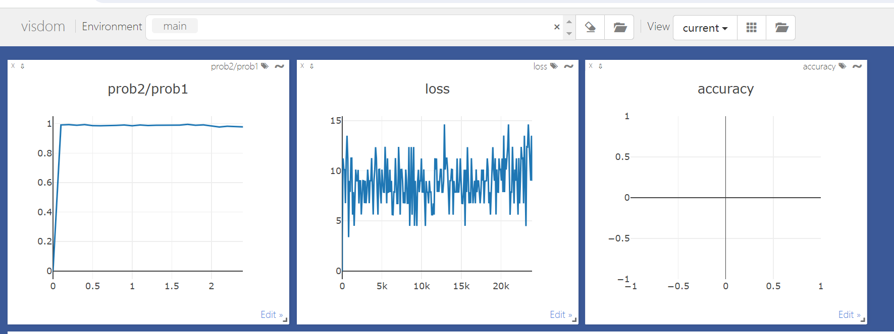

# 更新日志
##### 段文博

---

+ 2023.10.19
  + 尝试使用了新的detector(给detector简单地添加了增加微小随机噪音的处理，以尝试增强其能力)
+ 2023.10.20
  + 更新了detector的加噪模式，加大其加噪力度。确定采用高斯噪声。
  + 训练了新的detector，正在测试效果。
  + 正在调整代码中，变得更好看一些
  + 测试已经确认短期有效，继续运行查看长期效果。
  + 基本可以断定长期有效。考察检测器对于一般问题给出评价指标的稳定程度：  
    avg 1.0 var 0.0  
    avg 0.9999971044063568 var 1.3749001936957939e-12  
    avg 1.0 var 0.0  
    avg 1.0 var 0.0  
    avg 1.0 var 0.0  
    avg 1.0 var 0.0  
    avg 0.9999996042251587 var 6.8833827526759706e-15  
    avg 0.9999995160102845 var 2.2648549702353193e-14  
    avg 1.0 var 0.0  
    avg 1.0 var 0.0  
    avg 1.0 var 0.0  
    avg 1.0 var 0.0  
    avg 1.0 var 0.0  
    avg 1.0 var 0.0  
    avg 0.9997475695610046 var 5.699548943916e-09  
    avg 1.0 var 0.0  
    以上数据基于同一批图片（16张）生成100次得到，可以看到，检测器的性能并未因此降低。  
  
  图为基于该检测器训练的processor的训练效果，可以看到训练没有任何实质性进展
+ 2023.10.21
  + 在进行了长期训练（6epoch）之后，处理器学到了一定的信息，在测试集上能够将检测器给出的概率从98%降至92%，但是在训练集上已经出现了较为明显的过拟合现象（训练集已经从99%降至77%）因此暂停了训练。
+ 2023.10.22
  + detector下载链接：https://cloud.tsinghua.edu.cn/f/282ad5cc00d547dcb724/?dl=1
  + 尝试先将检测器训至99。99%准确率，再改变训练目标使检测器训至99.5%准确率